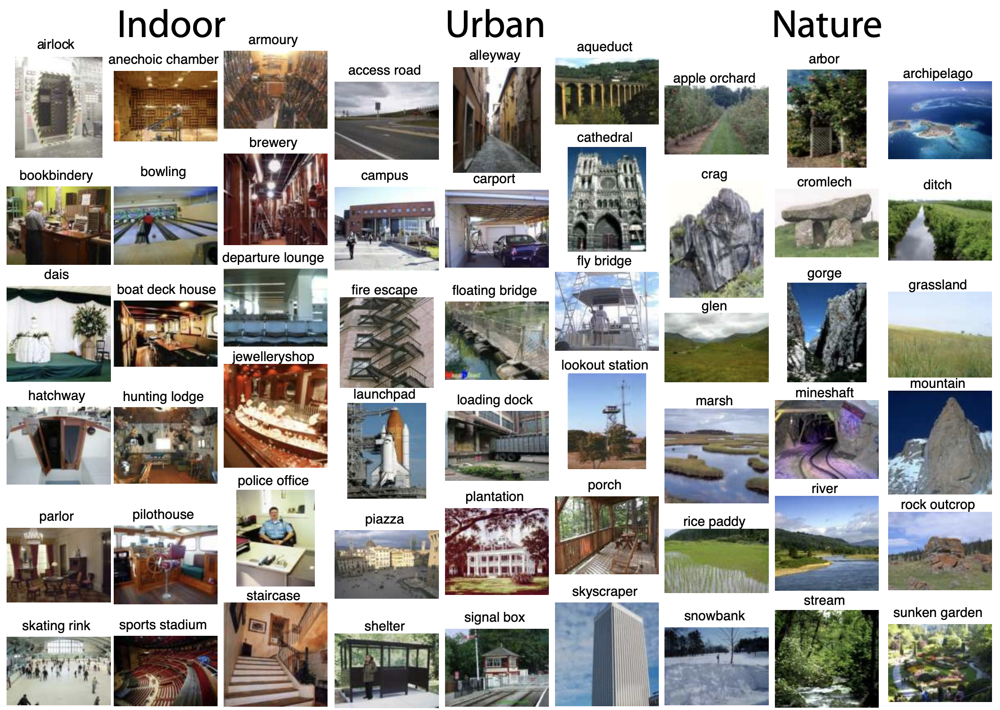
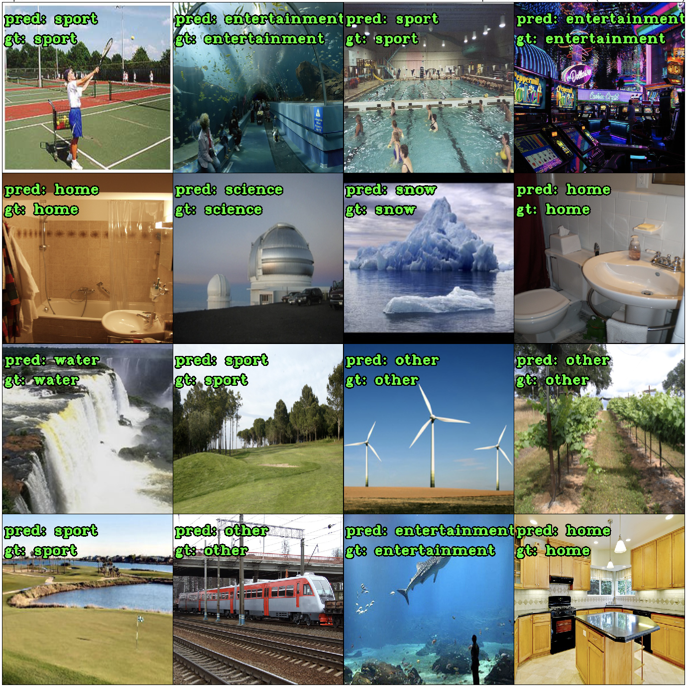
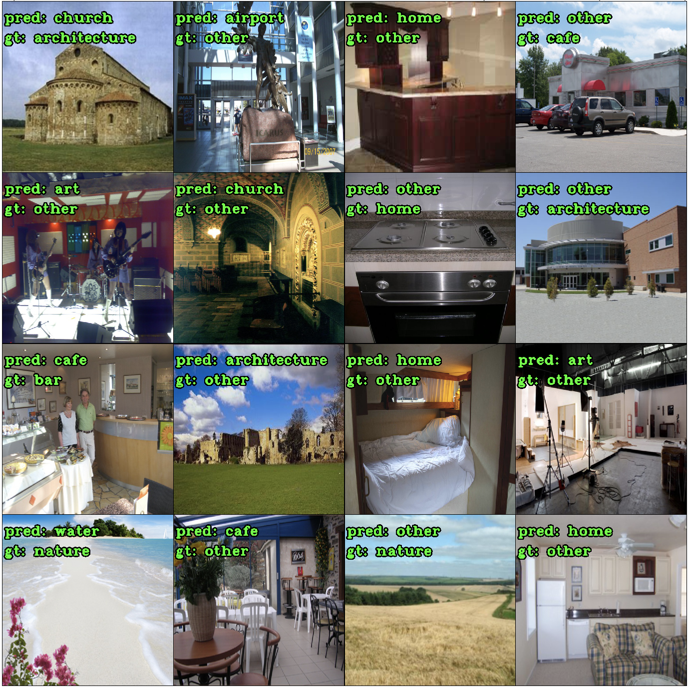
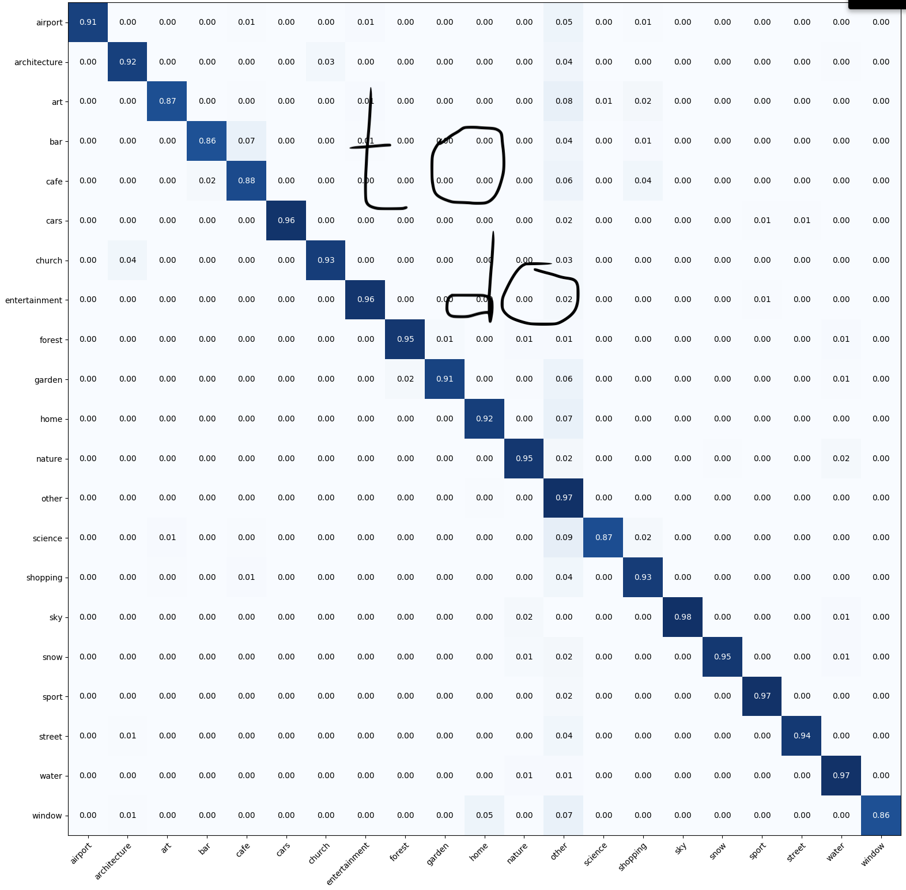

**Master work**

Repository for solving problem of photo tagging (in social networks) using
dataset for scene understanding task,
[link to SUN dataset](https://vision.princeton.edu/projects/2010/SUN/).

Text of my master work (in `.pdf` format with sources) can be found in `master_work` subfolder.

Examples of correct predicts:

Examples of incorrect predicts:

Confusion matrix for test part:

Validation dataset from Instagram can be found
 [here](https://drive.google.com/file/d/1SLAHIxzAk7eTLKUhPHRIJq7byoL72eAU/view?usp=sharing).
The corresponding predictions are
 [here](https://drive.google.com/file/d/1t3TW_qkvdMoMzIimyZNG9ukXnO8O2GjX/view?usp=sharing). Accuracy for this dataset is about 80%.

 
 For running tensorboard:
`tensorboard --logdir path_to_work_dir/board/`
