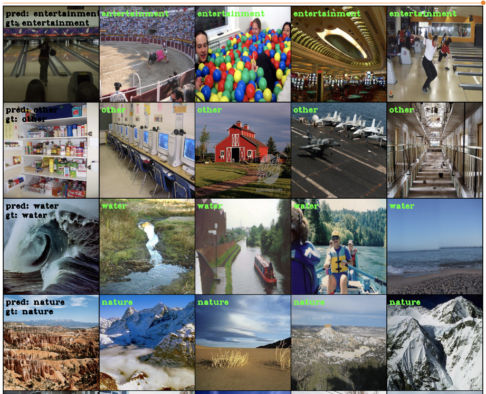
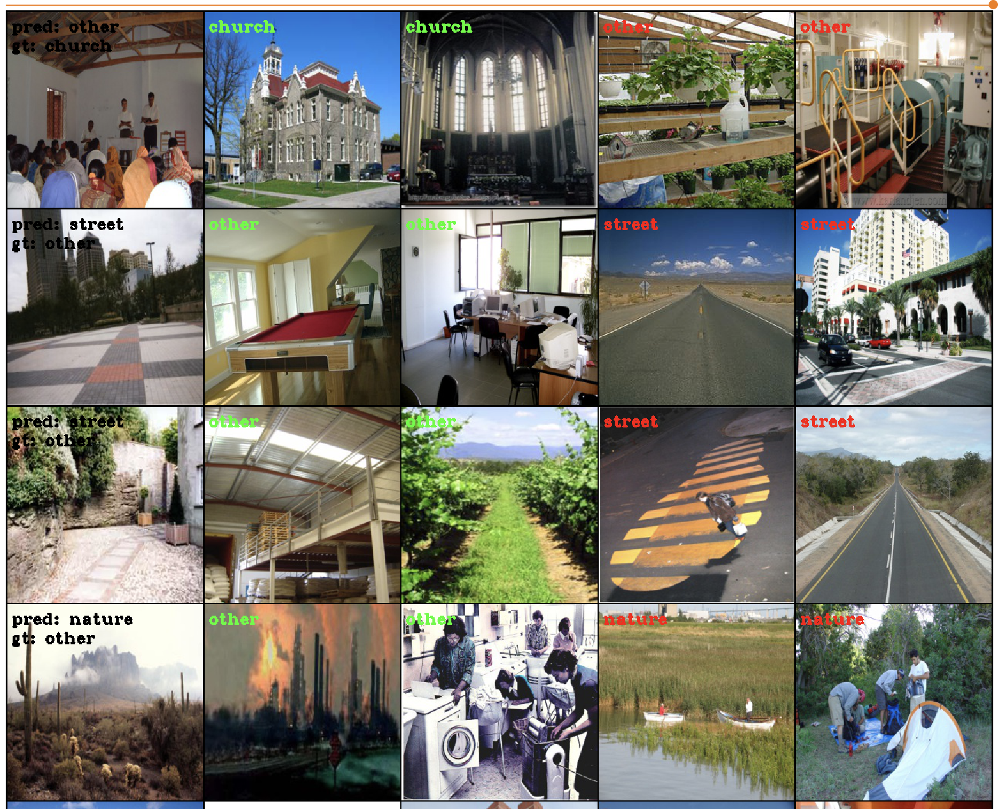

**SCENES**

Repository for solving scene understanding task 

Dataset [page](https://vision.princeton.edu/projects/2010/SUN/).

For running tensorboard:
`tensorboard --logdir path_to_work_dir/board/`

Correct predicts:

Left colomn contains query images,
 right rows contains samples for ground 
 truth and predicted tags.

Error predicts:
